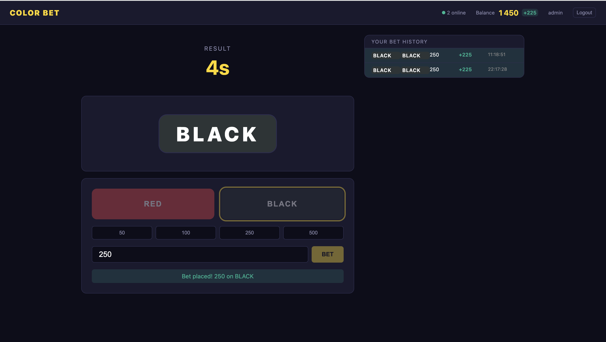

# Color Bet

Real-time binary betting game built to demonstrate a production-grade full-stack TypeScript architecture.

# Why I built this?

Built as a technical demonstration of production-grade real-time architecture patterns — horizontal scaling, distributed leader election, and type-safe WebSocket communication — using the exact stack used in high-traffic gaming platforms.".


## Screenshots

### Frontend



---

## Stack

| Layer | Technology |
|---|---|
| Frontend | React 18 + TypeScript + vanilla-extract + React-query |
| Backend | Node.js + Express + TypeScript |
| Real-time | Socket.io (typed events shared via monorepo package) |
| Scaling | Redis pub/sub + Socket.io Redis adapter |
| Database | PostgreSQL via Drizzle ORM |
| Auth | JWT (RS256 bearer tokens) |
| Rate limiting | express-rate-limit (auth + API) |
| Unit tests | Vitest (pure game-engine logic) |
| E2E tests | Playwright |
| CI/CD | GitHub Actions |

## Architecture highlights

### Horizontal scaling with Redis
The Socket.io Redis adapter lets you run **N backend instances** behind a load balancer. When any instance calls `io.emit()`, Redis propagates the message to all other instances so every connected client receives it.

### Leader election
Only one instance should drive the game loop. A Redis SETNX lock (`game:leader`) ensures exactly one "leader" runs the timer. If the leader crashes, the lock expires (TTL 15s) and another instance takes over.

### Atomic bet placement
Bets are stored in a Redis hash (`game:bets:{roundId}`). Using `HSETNX` (atomic set-if-not-exists) means duplicate bets from the same user are impossible even under concurrent requests from multiple server instances.

### Shared types monorepo
`packages/shared-types` defines Socket.io event maps used by both the server and client. TypeScript will error at compile time if either side uses a wrong event name or payload shape.

## Getting started

```bash
# 1. Start infrastructure
docker-compose up -d

# 2. Install dependencies
pnpm install

# 3. Copy and configure env
cp apps/backend/.env.example apps/backend/.env

# 4. Run migrations
pnpm --filter @color-bet/backend db:migrate

# 5. Start everything
pnpm dev
```

Frontend: http://localhost:5173  
Backend: http://localhost:3001

## Running tests

```bash
# Unit tests (game engine)
pnpm --filter @color-bet/game-engine test

# E2E (requires both services running)
pnpm test:e2e
```

## Game rules

| Phase | Duration | Description |
|---|---|---|
| BETTING | 20s | Pick RED or BLACK + enter amount |
| CLOSING | 5s | Bets locked, awaiting result |
| RESULT | 5s | Winner revealed, wallets updated |

Win payout: **1.9×** (5% house edge on binary outcome)
